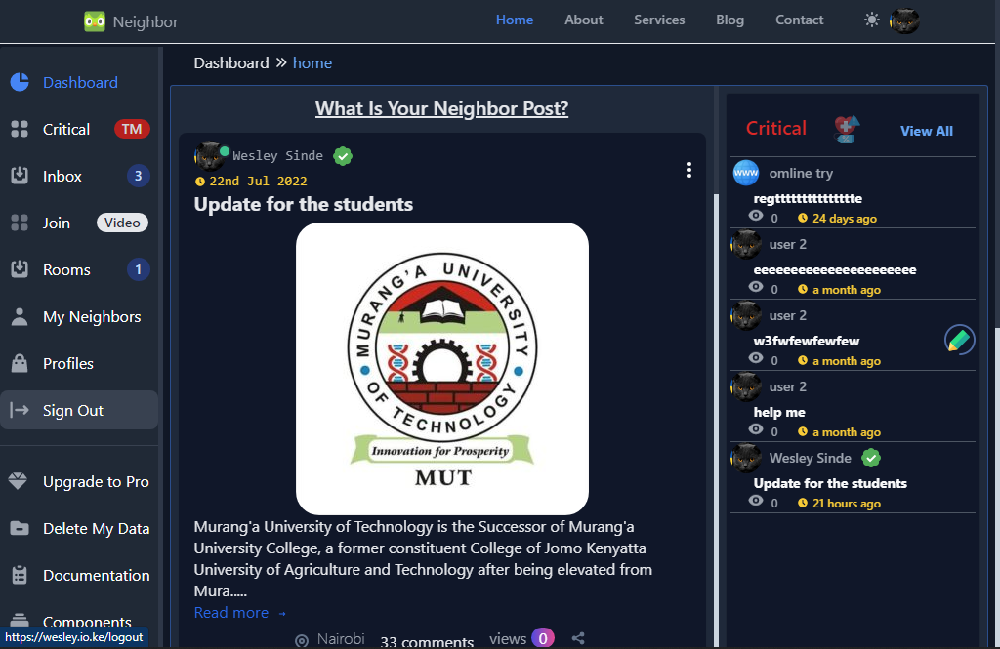

# What Is a Clone of Nextdoor?
The Nextdoor Clone is a neighborhood community app solution that allows you to dominate the local community app market with its captivating UI, painstakingly coded functionality, wonderfully loaded features, and many more features. Due to its complete customization, the app may be completely redone to meet your company's needs for a social community app.


Millions of concurrent users are easily handled by the high scalability factor, which also produces a performance that is packed with punch. Not to mention the option to white-label, which enables business owners to enter the market with their own logo, UX palette, and brand name. Utilize it at your specialty and it may be scaled easily with this app at your side!

# User dashboard preview

This application has been developed with Tailwind CSS, Laravel, and Vue.

# How to set this app?
* Run ```gh repo clone Wesley-Sinde/Social-networking-application-in-laravel-for-members-of-neighborhood-Nextdoo-clone-```'
* Run ```composer install```.
* Run cp .env.example .env or copy .env.example .env.
* Run ```php artisan key:generate```.
* Run ```php artisan migrate```.
* Run ```php artisan db:seed```.
* Run ```php artisan serve```.
* Go to link ```localhost:8000``` OR ```127.0.0.1:8000```.

# kindly star ⭐⭐ this repo if you get it helpful
#You can create issue or pull request if you feel i missed something to make it better
